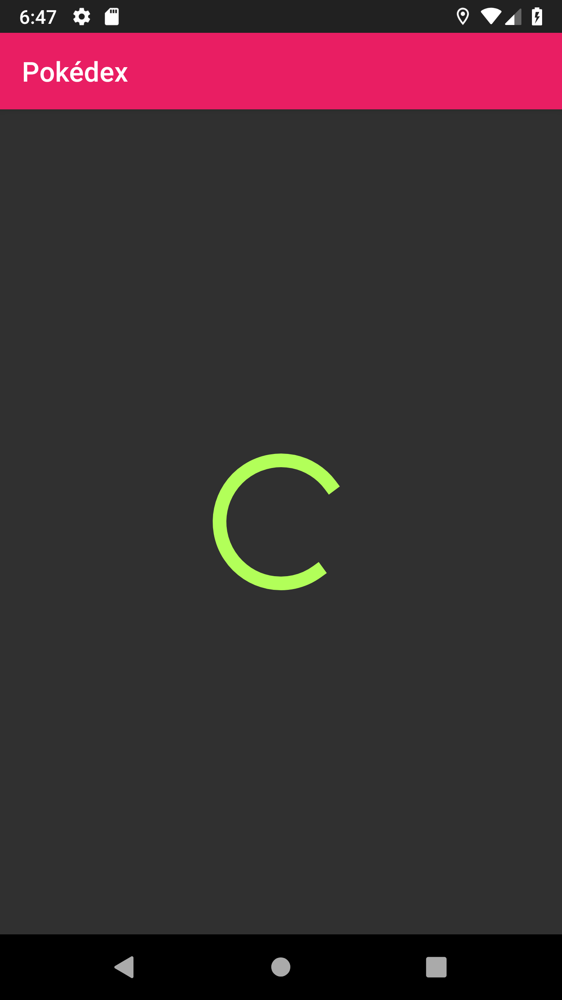
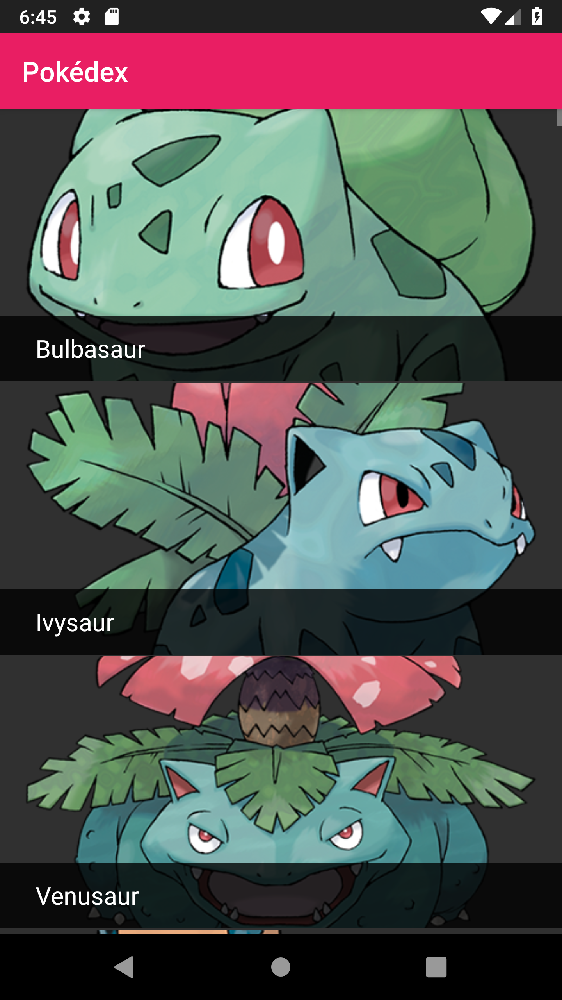
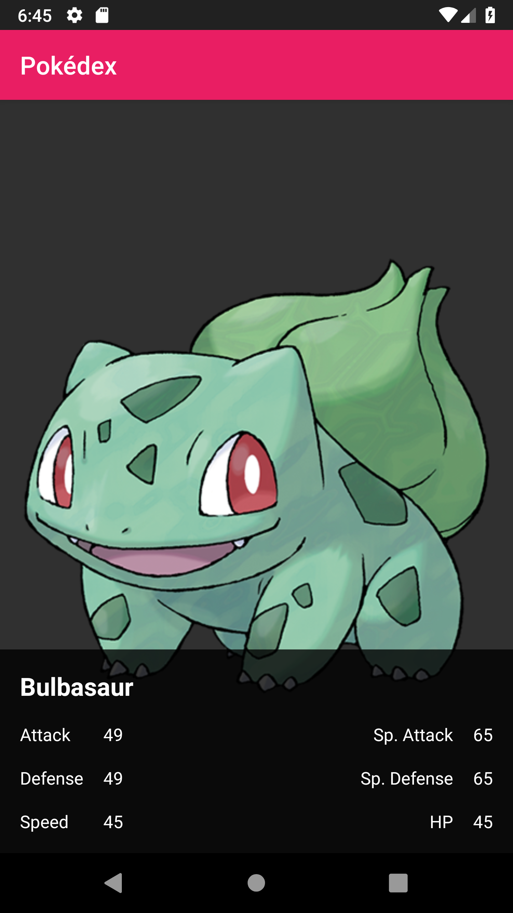

Gridstone Android Training
==========================

A starting point for those interested in learning the ways of the little green robot. This `README` provides details on a small training app that you will build. This is not a step-by-step tutorial, but rather a set of requirements, restrictions, and tips on how you should go about building an app.

This means that you'll be doing a lot of learning on your own to build this training app, but it should set you on the path of learning what Android development is like. If you need a bit more of a leg-up before attempting something like this, consider undertaking [Google's Udacity course](https://www.udacity.com/course/developing-android-apps--ud853) on beginning Android development.

However, if this is the droid you're looking for, read on.


Your Task
---------

You will be building an app that interfaces with the [Imgur API](https://api.imgur.com) to download a collection of trending images and display them in a list. The user must be able to tap on each item in the list to view a larger version of that image and some details about it.

Getting Started
---------------

Fork this repository! This repository contains a bare-bones empty app that doesn't do anything. (It's even more bare-bones than what Android Studio gives you for a new project, and that's very deliberate).

It *is* however already set up to use `app-compat`, which you'll need to achieve a material design look and feel on older devices. The application theme has already been set up for you, so you just need to think about actually building the app, not configuring styles.

### Choose a Language

We love [Kotlin](https://kotlinlang.org) at Gridstone, and it's our language of choice for all new Android apps. That being said, learning a new language in addition to the Android framework is a big ask! Stick to Java if you want to keep things simple.

You'll see that there are two app directories: `app` and `app-kotlin`. If you wish to build the app in Java then do your work in `app`. If you wish to try your hand at Kotlin then work inside of `app-kotlin`. You can change which app you're building in Android Studio by selecting `Run -> Run...`.

### Making the Thing

During your development, feel free to throw questions at any Android developer at Gridstone. They should be able to help you out, and don't bite often.

When you've finished, give a Gridstone Android developer read access to your repository. You can find an example implementation in the branch titled `ch/implementation-kotlin`. Note that this uses a different API but the implementation is still a good example.

Here are the states your app will need to display. Loading the list of Pokemon, displaying the list, and displaying Pokemon details.





The Requirements
----------------

### Code Style

At Gridstone, we make use of [Square's code styles](https://github.com/square/java-code-styles) for our Java and XML. Your repository must adhere to those styles, so run the install script from the aforementioned link and make sure you're using it to format your code in Android Studio.

### General Android-y Stuff
* Your app must run on Android 5.0 Lollipop and up. (That's API level 21).
* All network requests must execute off the main UI thread.
* The list must be displayed using a [`RecyclerView`](http://developer.android.com/training/material/lists-cards.html).
* The app must work in both portrait and landscape orientations
  - It must remember the list's scroll position between orientation changes. (Harder than it sounds).
  - It must not re-download the list of images on an orientation change.

### The Data

To get the list of Pokemon, you'll need to make a network request to PokeAPI's endpoint. Specifically, you'll be calling:
```
https://pokeapi.co/api/v2/pokemon?limit=151
```
This will give you a list of the first 151 Pokemon in the pokedex, which is all we need for this training. Note that this does not give you the details for each of those Pokemon (e.g. stats), only their `name` and a `url` that fetches their details.

The responses you get from PokeAPI will be in JSON, which is perfect. The structure of these response objects is described [here in the PokeAPI's documentation](https://pokeapi.co/docs/v2.html#pokemon). The list response is simple, as described above. However, there are quite a few fields when fetching details, but for the purposes of this demo we can focus on just a few. Specifically:
```
id
name
stats
```

If you would rather experiment with the API hands-on rather than read documentation, [Postman](https://www.getpostman.com/) is a useful tool for this.

### Images

The PokeAPI endpoint returns links to thumbnails, but these are relatively small. Instead, we will get images from the Pokemon Official Pokedex website. The link below will return a high resolution image if the ID at the end (in this case, `001`) is valid. (Note that whilst the list endpoint does not return the ID of the individual Pokemon, we can assume that their index in the list, plus one, is their ID).

```
https://assets.pokemon.com/assets/cms2/img/pokedex/full/001.png
```

### The User Interface

This app will be composed of two screens. The list screen and the details screen.

#### For the list
* The 151 Pokemon should be displayed in the list as per the UI guidelines below.
* Each image must be `200dp` tall, and as wide as the screen.
* There must be a gap of `1dp` between each image.
* Each image should be centre-cropped, meaning that within the bounds of `width * height`, the image cannot be stretched or show any blank areas.
* The Pokemon's name must be displayed on top of each image (as shown in the screenshot above)
* While the list of Pokemon is downloading, you must display an indeterminate [`ProgressBar`](https://developer.android.com/reference/android/widget/ProgressBar.html).
  - You do not need to display the progress bar while downloading the Pokemon images, just while you retrieve the list.

#### For the details
* You must display the Pokemon's image to take up the entire screen.
* You must display the Pokemon's name, attack, defense, sp. attack, sp. defense, speed and HP as shown in the sample screenshot.

Some Tips
---------

Downloading images, caching them, and putting them into `ImageViews` is crazy complex! Thankfully, a library called [Picasso](http://square.github.io/picasso/) developed by Square turns that process into a single line of code.

Since you'll be interfacing with a REST API, you'll need to execute HTTP requests and parse response data. If you'd like a simple way to execute a request and map it simple model objects, consider [Retrofit](http://square.github.io/retrofit/), another library by Square. It does have a learning curve, but it makes interfacing with web services much simpler!

Beware `AsyncTask`! It might seem like a convenient way to do work off the main thread, but it has many shortcomings! (Chiefly, it's very easy to leak memory like a sieve). Consider the callback options Retrofit provides, or an [`IntentService`](https://developer.android.com/reference/android/app/IntentService.html), or even [`RxJava`](https://github.com/ReactiveX/RxJava) if you're feeling adventurous.

When structuring the navigation between two screens, you have many options available to you. You could use multiple `Activities`, or a single `Activity` that moves between `Fragments`. Or you could even go nuts and use a library like [Conductor](https://github.com/bluelinelabs/Conductor). Whatever you choose, you're going to discover that architecting data-flow is one of the hardest parts to Android development. Consider executing and caching your network request in something that isn't your `Activity` or `Fragment`.
